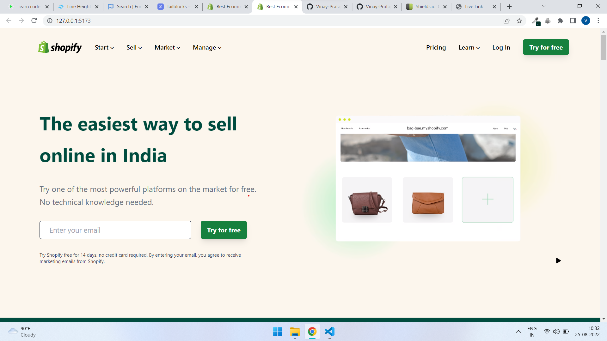
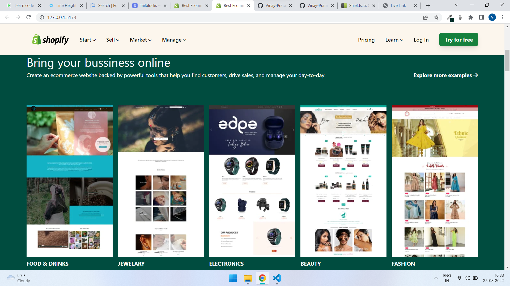
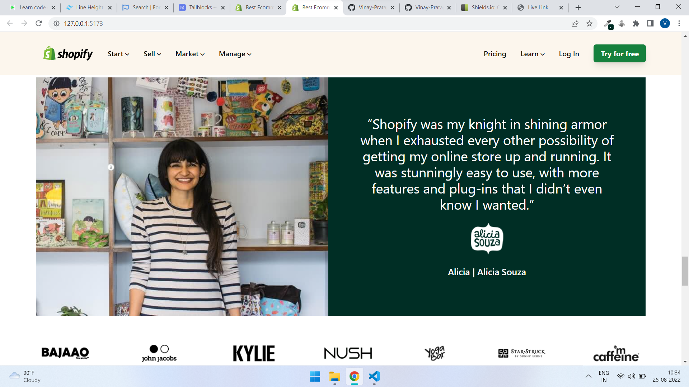
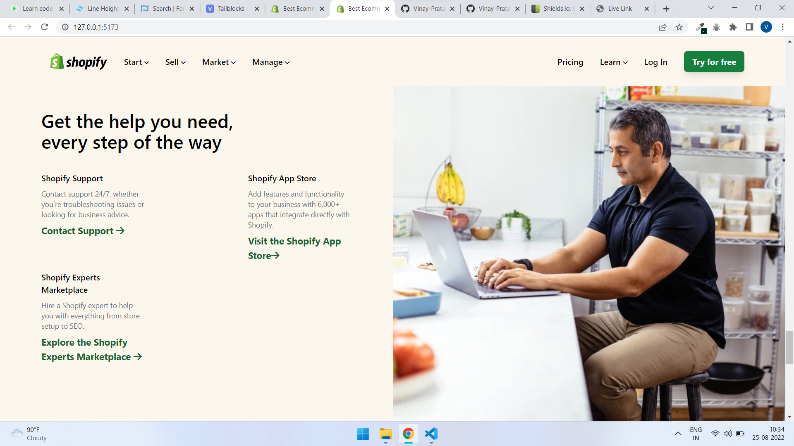

# Shopify UI Clone by **Vinay Pratap Singh** #

# **Project Description** #
This is a user interface clone of the one of the most popular shopping website known as Shopify.
This website is complete clone of that website from top to bottom with some interface modification at some places to make it look more engazing.

This website is responsive for both the desktop and mobile phones so that a user can easily have a good experience in both the devices.

# **Technology Used** #
1. Pure HTML

2. Tailwind CSS

# **Live Link** #
Visit the website using given link to check and if have any suggestion then let me know to improve.

# **Output Images** #
    
    
    
    
    
